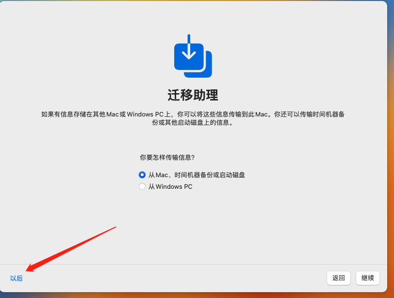

# 虚拟机安装macOS

> 体验了一下13.2.0版太卡，又安装了macOS10.15版，比13.2.0版快很多

### 准备

1. 下载安装VMware Workstation（VM17）

2. 解锁VM虚拟机的MAC补丁 [Unlocker]

3. 安装VMwaer Tools，需要darwin.iso文件

4. macOS镜像（macOS13.2）

### 安装

#### 解锁VMware

- 打开任务管理器，停掉所有VMware的服务。

- 打开Unlocker，以管理员身份运行win-install.cmd 以解锁虚拟机

#### 新建虚拟机

- 打开VMware17，创建新虚拟机，并选择典型安装

- 点击浏览，选择下载好macOS系统的文件夹

- 选择系统镜像，选择好镜像文件以后点击下一步

- 选择Apple macOS X，最下面选择安装的系统版本，选择安装的版本，并进行下一步

- 定义名称，及选择安装的位置，并进行下一步

- 分配磁盘容量，选择将虚拟磁盘存储为单个文件，并进行下一步

- 自定义硬件设定虚拟机的内存、网络模式等

- 设置完成，打开保存虚拟机文件的目录，找到.vmx结尾的文件，打开在末尾添加smc.version = 0

#### 开启虚拟机

- 选择简体中文

- 选择磁盘工具

- 选择VMware开头的磁盘，点击「磁盘工具」四个字下面的「抹掉」给磁盘起一个名字，点击「抹掉」按钮，点击完成

- 然后点击磁盘工具左上角的关闭按钮关闭

- 安装macOS到抹掉并重命名为shuai的磁盘，等待安装完成

#### 引导

- 地区选择中国，键盘选择简体中文，之后无脑继续

- 选择以后，网络设置-继续

- 数据迁移，以后

- 创建账户和密码

- 选择地区

- 安装完毕

### 配置

##### 调试网络

- 关闭客户机，编辑虚拟机设置

ps：调试了半天，最后还是选择桥接模式可以连接网络了，如果选择桥接模式没有网，在进行下边操作试试

#### 安装VMwaer Tools

- 如果无法安装，下载darwin.iso

- 选择下载好的darwin.iso文件

重新启动macOs

- 如果安装失败，偏好设置允许

----

----

> 以下是网络不可用时折腾（可忽略）

- 网络适配器，网络连接选择NAT模式，确定

设备状态-已连接设置；打开cmd，输入services.msc

把框起来的这三项，右键-启动，启动后变成正在运行

- 打开控制面板，搜索网络连接

- 找到VMnet8的连接，右键属性-->共享

- 勾选允许其他网络用户通过此计算机的Internet连接来连接 
- 选择VMware

